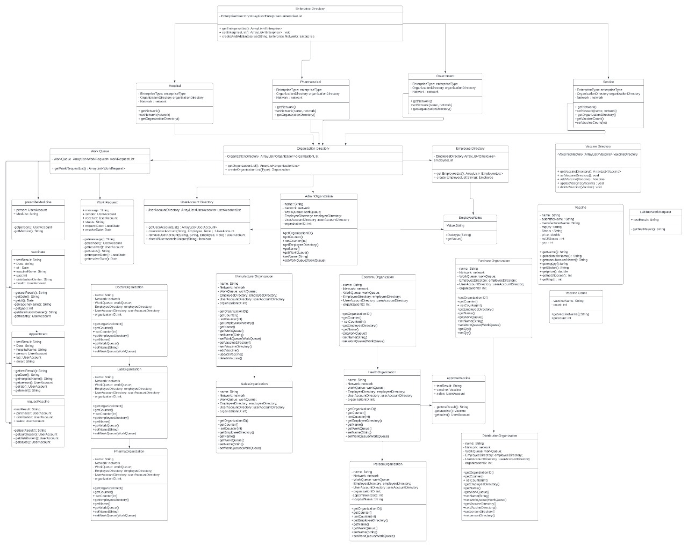
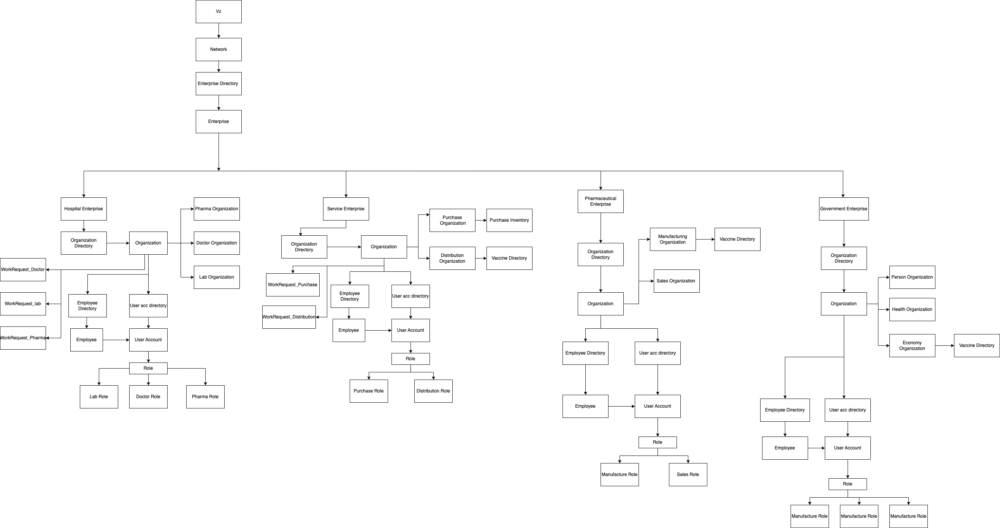

# 5100-AED-PROJECT (Fall 2022)

## NUID:
+ Rucha Chotalia: 002711888
+ Aakash Rajawat: 002764127
+ Diya Baldota: 002747966

## Class Diagram: 

  

## Object Model:

  

## Problem Statement:
To incorporate faster manufacturing and delivering the flu vaccines to the final entity i.e. the patients that was faced in the issue of covid vaccine availability is solved in this application. This application targets all types of vaccination.

## How we have solved the problem:
The project starts with a home page with a login section. To go to the backend of the project to manage the Network, Enterprises and Enterprise Managers use username: sysadmin // password: sysadmin. Once you log into the back end, one can perform all the CRUD for the enterprises. After that one need to log into their respective enterprises and add respective Organizations under them and perform respective functions. They also need to create Organization admins so that each respective organization has an Organization Manager.Entire supply chain process of delivering a vaccine from a manufacturer to finally a patient is solved in this Flushot Vaccine Application.The lab manufactures the vaccine and sends it to the doctor who vaccinates the patient. 
